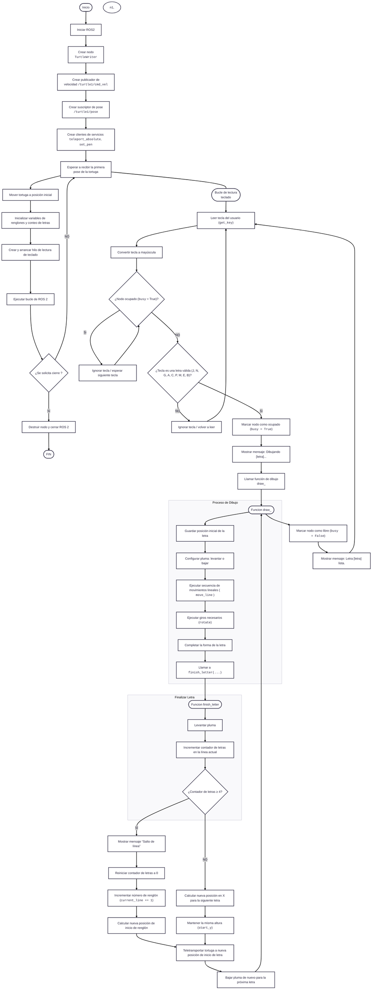

```mermaid
---
config:
  theme: redux
---
flowchart TB
    n1(["Inicio"]) --> n2["Iniciar ROS2"]
    n2 --> n3["Crear nodo <br><code>TurtleWriter</code>"]
    n3 --> n4["Crear publicador de<br>velocidad <code>/turtle1/cmd_vel</code>"]
    n4 --> n5["Crear suscriptor de pose<br><code>/turtle1/pose</code>"]
    n5 --> n6["Crear clientes de servicios <br><code>teleport_absolute</code>, <code>set_pen</code>"]
    n6 --> n7["Esperar a recibir la primera <br>pose de la tortuga"]
    n7 --> n8["Mover tortuga a posición inicial"]
    
    %% Conexión al hilo de teclado (paralelo)
    n7 --- n15(["Bucle de lectura<br>teclado"])
    
    %% Flujo principal
    n8 --> n9["Inicializar variables de renglones y conteo de letras"]
    n9 --> n10["Crear y arrancar hilo de lectura de teclado"]
    n10 --> n11["Ejecutar bucle de ROS 2"]
    n11 --> n12{"¿Se solicita cierre ?"}
    n12 -- Sí --> n13["Destruir nodo y cerrar ROS 2"]
    n13 --> n14(["FIN"])
    n12 -- NO --> n7
    
    %% Hilo de Teclado
    n15 --> n16["Leer tecla del usuario (<code>get_key</code>)"]
    n16 --> n17["Convertir tecla a mayúscula"]
    n17 --> n18{"¿Nodo ocupado (<code>busy</code> = True)?"}
    n18 -- Si --> n19["Ignorar tecla / esperar siguiente tecla"]
    n18 -- NO --> n20{"¿Tecla es una letra válida (J, N, G, A, C, P, M, E, B)?"}
    n19 --> n18
    n20 -- NO --> n21["Ignorar tecla / volver a leer"]
    n20 -- Sí --> n22["Marcar nodo como ocupado (<code>busy = True</code>)"]
    n21 --> n16 
    
    %% Ejecución de Dibujo
    n22 --> n23["Mostrar mensaje: Dibujando [letra]..."]
    n23 --> n24["Llamar función de dibujo<br>draw_"]
    n24 --> n25(["Funcion draw_"])
    n25 --> n27["Marcar nodo como libre (<code>busy = False</code>)"]
    n27 --> n26["Mostrar mensaje: Letra [letra] lista."]
    n26 --> n16
    
    %% Subflujo de la Función draw_ (Dentro de 25)
    subgraph Proceso de Dibujo
        n25 --> n28["Guardar posición inicial de la letra"]
        n28 --> n29["Configurar pluma: levantar o bajar"]
        n29 --> n30["Ejecutar secuencia de movimientos lineales ( <code>move_line</code> )"]
        n30 --> n31["Ejecutar giros necesarios (<code>rotate</code>)"]
        n31 --> n32["Completar la forma de la letra"]
        n32 --> n33["Llamar a <code>finish_letter(...)</code>"]
    end
    
    %% Flujo de finish_letter (Subflujo de 33)
    subgraph Finalizar Letra
        n33 --> n36(["Funcion finish_letter"])
        n36 --> n34["Levantar pluma"]
        n34 --> n35["Incrementar contador de letras en la línea actual"]
        n35 --> n37{"¿Contador de letras ≥ 4?"}
    end
    
    %% Salto de Línea
    n37 -- SÍ --> n38["Mostrar mensaje “Salto de línea”"] 
    n38 --> n39["Reiniciar contador de letras a 0"]
    n39 --> n40["Incrementar número de renglón (<code>current_line += 1</code>)"]
    n40 --> n41["Calcular nueva posición de inicio de renglón"]
    n41 --> n44
    
    %% No Salto de Línea
    n37 -- NO --> n42["Calcular nueva posición en X para la siguiente letra"]
    n42 --> n43["Mantener la misma altura (<code>start_y</code>)"]
    n43 --> n44["Teletransportar tortuga a nueva posición de inicio de letra"]
    
    %% Continuación
    n44 --> n45["Bajar pluma de nuevo para la próxima letra"]
    n45 --> n25
    
    %% Estilos (Solo para asegurar formas y bordes, sin forzar el color de fondo)
    style n12 shape:diamond
    style n18 shape:diamond
    style n20 shape:diamond
    style n37 shape:diamond
    
    style n1, n14, n15, n25, n36 rx:100,ry:100
```
