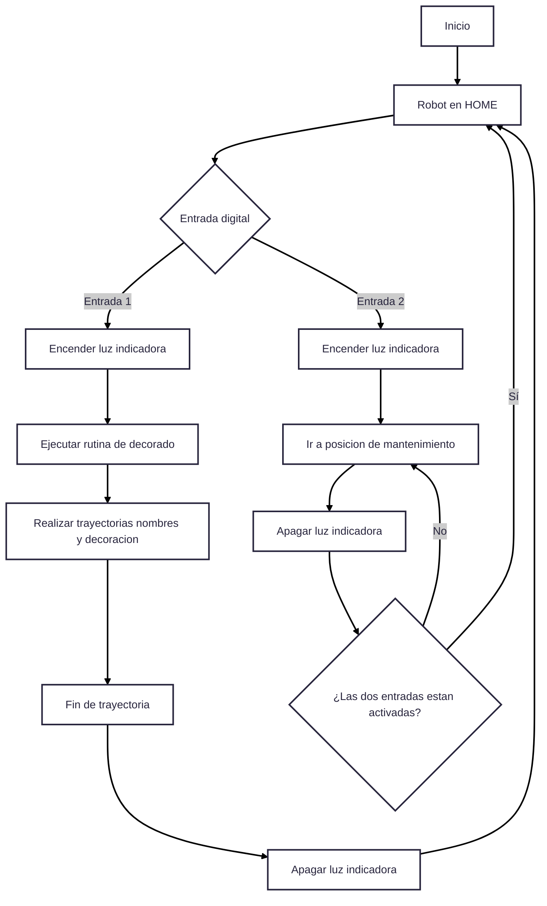

```mermaid
---
config:
  theme: redux
---
flowchart TD

    A[Inicio] --> B[Robot en HOME]

    B --> C{Entrada digital}

    C -- Entrada 1 --> D[Encender luz indicadora]
    D --> E[Ejecutar rutina de decorado]
    E --> F[Realizar trayectorias nombres y decoracion]
    F --> G[Fin de trayectoria]
    G --> H[Apagar luz indicadora]
    H --> B

    C -- Entrada 2 --> J[Encender luz indicadora]
    J --> K[Ir a posicion de mantenimiento]
    K --> L[Apagar luz indicadora]

    L --> M{¿Las dos entradas estan activadas?}
    M -- No --> K
    M -- Sí --> B
```
