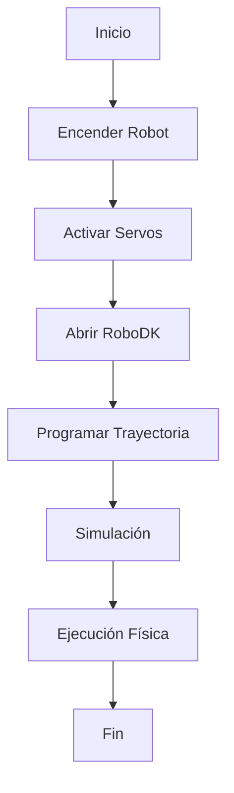

<!-- ===== EQUIPO ===== -->

<div align="center">

<!-- ================== INTEGRANTE 1 ================== -->

<p>
  
</p>

<b>Carrera:</b> Ingeniería Mecatrónica <br>
<b>Correo:</b> gbojaca@unal.edu.co <br>
<b>GitHub:</b> <a href="https://github.com/usuariogithub">usuariogithub</a> <br>
<b>Rol:</b> Simulación y documentación <br>
<b>Intereses:</b> Robótica móvil, automatización <br><br>

<p style="max-width:500px;">
Me interesa mucho la simulación y cómo se pueden modelar sistemas mecatrónicos para entender mejor su comportamiento. También me gusta la automatización y la robótica , sobre todo ver cómo funcionan y cómo se pueden mejorar.
</p>

<br><br>

<!-- ================== INTEGRANTE 2 ================== -->
<p>
  
</p>


<b>Carrera:</b> Ingeniería Mecatrónica <br>
<b>Correo:</b> mmorillot@unal.edu.co <br>
<b>GitHub:</b> <a href="https://github.com/mmorillot">mmorillot</a> <br>
<b>Rol:</b> Modelado, programación y control <br>
<b>Intereses:</b> Control de robots, manipulación.<br><br>

<p style="max-width:500px;">
Actualmente estoy en décimo semestre de Ingeniería. Me interesa el área de control de robots, especialmente entender cómo funcionan y cómo se pueden hacer más precisos. También me llama la atención la parte de manipulación.
</p>

# Laboratorio No. 02 - Robótica Industrial
## Análisis y Operación del Manipulador Motoman MH6

### Integrantes
- Nombre 1
- Nombre 2

### Curso
Robótica Industrial – 2026-I

---

# Introducción

En este laboratorio se realizó el análisis y operación del manipulador industrial Motoman MH6, comparándolo con el ABB IRB140 en términos de características técnicas, configuraciones iniciales y modos de operación.

Además, se utilizó RoboDK para realizar simulaciones y ejecutar trayectorias en el robot físico.

---

# Objetivos

- Comparar las especificaciones técnicas del Motoman MH6 y el ABB IRB140.
- Identificar las configuraciones Home1 y Home2 del Motoman MH6.
- Realizar movimientos manuales en modo articular y cartesiano.
- Configurar velocidades manuales del manipulador.
- Comprender el funcionamiento de RoboDK.
- Implementar una trayectoria polar en RoboDK y ejecutarla físicamente.

---

# Comparación de Manipuladores

| Característica | Motoman MH6 | ABB IRB140 |
|---|---|---|
| Grados de libertad | 6 | 6 |
| Alcance máximo | 1422 mm | 810 mm |
| Carga máxima | 6 kg | 6 kg |
| Repetibilidad | ±0.08 mm | ±0.03 mm |
| Peso del robot | 130 kg aprox. | 98 kg aprox. |
| Aplicaciones típicas | Soldadura, ensamblaje, manipulación | Pick and place, ensamblaje |

---

# Configuraciones Iniciales del Motoman MH6

## Home1
La configuración Home1 corresponde a la posición inicial estándar del robot.

## Home2
La configuración Home2 corresponde a una segunda posición de referencia utilizada para ciertas trayectorias.

## ¿Cuál posición es mejor?

La posición Home1 suele ser más conveniente porque:
- Reduce riesgos de colisión.
- Facilita la programación inicial.
- Permite una mejor visualización del robot.

---

# Movimiento Manual del Manipulador

## Movimiento por Articulaciones

1. Seleccionar modo manual.
2. Activar servos.
3. Ingresar al modo Joint.
4. Seleccionar articulación.
5. Mover el eje usando el teach pendant.

---

# RoboDK

## Aplicaciones Principales

- Simulación de robots
- Programación offline
- Validación de trayectorias
- Detección de colisiones

---

# Comparación entre RoboDK y RobotStudio

| Característica | RoboDK | RobotStudio |
|---|---|---|
| Compatibilidad | Multimarca | Solo ABB |
| Facilidad de uso | Alta | Media |
| Simulación | Sí | Sí |

---

# Trayectoria Polar

## Código

```python
import math

radio = 200

for angulo in range(0, 360, 10):
    x = radio * math.cos(math.radians(angulo))
    y = radio * math.sin(math.radians(angulo))

    print(x, y)
```

---

# Diagrama de Flujo



---

# Conclusiones

- El Motoman MH6 posee gran alcance y versatilidad industrial.
- RoboDK facilita la programación offline.
- La trayectoria polar permitió validar la comunicación entre software y robot físico.

---

