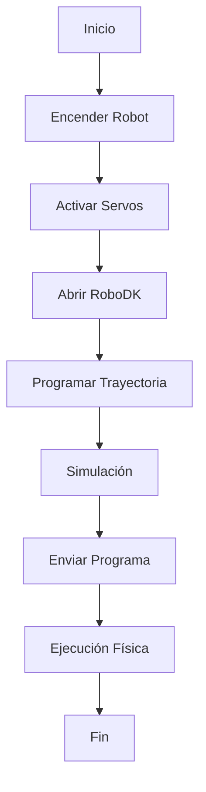

<!-- ===== EQUIPO ===== -->

<div align="center">

<!-- ================== INTEGRANTE 1 ================== -->

<p>
  
</p>

<b>Carrera:</b> Ingeniería Mecatrónica <br>
<b>Correo:</b> gbojaca@unal.edu.co <br>
<b>GitHub:</b> <a href="https://github.com/usuariogithub">usuariogithub</a> <br>
<b>Rol:</b> Simulación y documentación <br>
<b>Intereses:</b> Robótica móvil, automatización <br><br>

<p style="max-width:500px;">
Me interesa mucho la simulación y cómo se pueden modelar sistemas mecatrónicos para entender mejor su comportamiento. También me gusta la automatización y la robótica , sobre todo ver cómo funcionan y cómo se pueden mejorar.
</p>

<br><br>

<!-- ================== INTEGRANTE 2 ================== -->
<p>
  
</p>


<b>Carrera:</b> Ingeniería Mecatrónica <br>
<b>Correo:</b> mmorillot@unal.edu.co <br>
<b>GitHub:</b> <a href="https://github.com/mmorillot">mmorillot</a> <br>
<b>Rol:</b> Modelado, programación y control <br>
<b>Intereses:</b> Control de robots, manipulación.<br><br>

<p style="max-width:500px;">
Actualmente estoy en décimo semestre de Ingeniería. Me interesa el área de control de robots, especialmente entender cómo funcionan y cómo se pueden hacer más precisos. También me llama la atención la parte de manipulación.
</p>


---

# Introducción

En este laboratorio se realizó el análisis y operación del manipulador industrial Motoman MH6, comparándolo con el ABB IRB140 en términos de características técnicas, configuraciones iniciales y modos de operación.  

Además, se utilizó RoboDK para realizar simulaciones y ejecutar trayectorias en el robot físico, permitiendo comprender la programación offline y la comunicación entre el software y el manipulador.

---

# Objetivos

- Comparar las especificaciones técnicas del Motoman MH6 y el ABB IRB140.
- Identificar las configuraciones Home1 y Home2 del Motoman MH6.
- Realizar movimientos manuales en modo articular y cartesiano.
- Configurar velocidades manuales del manipulador.
- Comprender el funcionamiento de RoboDK.
- Implementar una trayectoria polar en RoboDK y ejecutarla físicamente.

---

# Comparación de Manipuladores

| Característica | Motoman MH6 | ABB IRB140 |
|---|---|---|
| Grados de libertad | 6 | 6 |
| Alcance máximo | 1422 mm | 810 mm |
| Carga máxima | 6 kg | 6 kg |
| Repetibilidad | ±0.08 mm | ±0.03 mm |
| Peso del robot | 130 kg aprox. | 98 kg aprox. |
| Aplicaciones típicas | Soldadura, ensamblaje, manipulación | Pick and place, ensamblaje |
| Tipo de robot | Antropomórfico | Antropomórfico |

## Análisis Comparativo

El Motoman MH6 posee un alcance considerablemente mayor que el IRB140, lo cual lo hace más adecuado para aplicaciones donde se requiere cubrir áreas amplias de trabajo.  

Por otro lado, el ABB IRB140 tiene una mejor repetibilidad, siendo más preciso en tareas delicadas de ensamblaje o manipulación fina.  

Ambos robots poseen 6 grados de libertad y capacidades similares de carga, pero están orientados a aplicaciones industriales diferentes dependiendo de los requerimientos de precisión y espacio de trabajo.

---

# Configuraciones Iniciales del Motoman MH6

## Home1

La configuración Home1 corresponde a la posición inicial estándar del robot, donde las articulaciones se encuentran alineadas de manera segura y preparada para comenzar operaciones.

Generalmente:
- El brazo queda orientado hacia adelante.
- Las articulaciones permanecen en posiciones neutras.
- Se minimiza el riesgo de colisión.

## Home2

La configuración Home2 corresponde a una segunda posición de referencia utilizada principalmente para facilitar ciertas trayectorias o configuraciones específicas del entorno de trabajo.

En esta posición:
- El brazo puede quedar más recogido.
- Cambia la orientación de algunas articulaciones.
- Puede facilitar mantenimiento o reinicio de tareas.

## ¿Cuál posición es mejor?

La posición Home1 suele ser más conveniente debido a que:
- Es más intuitiva para iniciar operaciones.
- Reduce riesgos de colisión.
- Facilita la calibración y programación inicial.
- Permite una mejor visualización del robot.

Sin embargo, la elección depende del entorno de trabajo y de la tarea específica a realizar.

---

# Movimiento Manual del Manipulador

## Movimiento por Articulaciones

Para mover el robot por articulaciones se utiliza el modo **Joint** o **Axis** desde el teach pendant.

Procedimiento:
1. Seleccionar el modo manual.
2. Activar servos.
3. Ingresar al modo Joint.
4. Seleccionar la articulación deseada.
5. Utilizar las teclas de desplazamiento para mover el eje.

En este modo cada articulación se mueve individualmente.

---

## Movimiento Cartesiano

El movimiento cartesiano permite desplazar el efector final en:
- X
- Y
- Z

sin modificar directamente cada articulación.

Procedimiento:
1. Cambiar al modo Cartesian.
2. Seleccionar el eje deseado.
3. Utilizar las teclas de movimiento.

---

## Traslaciones y Rotaciones

### Traslaciones
Permiten mover el TCP en:
- Eje X
- Eje Y
- Eje Z

### Rotaciones
Permiten rotar la herramienta respecto a:
- Rx
- Ry
- Rz

Estas funciones son útiles para posicionar herramientas y orientar correctamente el efector final.

---

# Control de Velocidad

## Niveles de Velocidad

El Motoman MH6 permite ajustar diferentes niveles de velocidad durante el movimiento manual.

Los niveles pueden variar desde:
- Muy baja velocidad
- Baja
- Media
- Alta velocidad

---

## ¿Cómo se cambia la velocidad?

La velocidad se modifica desde el teach pendant utilizando:
- Botones dedicados de velocidad
- Menús de configuración manual

El operador selecciona el porcentaje de velocidad deseado.

---

## ¿Cómo se identifica el nivel de velocidad?

En la pantalla del controlador aparece:
- El porcentaje de velocidad actual
- Indicadores gráficos del nivel configurado

Por ejemplo:
- 10%
- 25%
- 50%
- 100%

---

# RoboDK

## Aplicaciones Principales

RoboDK es un software de simulación y programación offline utilizado para:
- Simular robots industriales.
- Validar trayectorias.
- Programar robots sin detener producción.
- Generar código automáticamente.
- Detectar colisiones.
- Optimizar movimientos.

---

## ¿Cómo se comunica RoboDK con el manipulador?

RoboDK se comunica con el robot mediante:
- Conexión Ethernet.
- Drivers específicos del fabricante.
- Protocolos de comunicación industrial.

El computador envía instrucciones al controlador del robot para ejecutar movimientos.

---

## ¿Qué hace RoboDK para mover el manipulador?

RoboDK:
1. Calcula trayectorias.
2. Realiza cinemática inversa.
3. Genera posiciones articulares.
4. Envía instrucciones al controlador.
5. Ejecuta los movimientos físicamente.

---

# Comparación entre RoboDK y RobotStudio

| Característica | RoboDK | RobotStudio |
|---|---|---|
| Compatibilidad | Multimarca | Solo ABB |
| Facilidad de uso | Alta | Media |
| Programación offline | Sí | Sí |
| Simulación | Sí | Sí |
| Aplicaciones educativas | Muy utilizadas | Utilizadas |
| Personalización | Alta | Alta |

## Análisis

### RoboDK
RoboDK es una herramienta flexible y fácil de usar que permite trabajar con múltiples marcas de robots industriales. Es ideal para simulación académica y validación rápida de trayectorias.

### RobotStudio
RobotStudio es una herramienta especializada para robots ABB. Tiene integración profunda con controladores ABB y permite simulaciones más detalladas para esa marca.

## ¿Qué significa cada herramienta?

- RoboDK representa una plataforma universal de simulación y programación.
- RobotStudio representa una herramienta especializada y avanzada para robots ABB.

---

# Trayectoria Polar

## Descripción

Se programó una trayectoria polar en RoboDK utilizando coordenadas polares para generar un movimiento circular del efector final.

La trayectoria fue simulada virtualmente y posteriormente ejecutada en el robot físico Motoman MH6.

---

# Código de la Trayectoria Polar

```python
import math

radio = 200

for angulo in range(0, 360, 10):
    x = radio * math.cos(math.radians(angulo))
    y = radio * math.sin(math.radians(angulo))
    
    print(x, y)
```

---

# Diagrama de Flujo



---

# Plano de Planta

## Elementos
- Robot Motoman MH6
- Computador de control
- Mesa de trabajo
- Área de seguridad
- Teach Pendant

---

# Evidencias

## Simulación en RoboDK
Agregar capturas de pantalla de la simulación.

## Implementación Física
Agregar fotografías o videos del robot ejecutando la trayectoria.

---

# Videos

## Video de Simulación
Agregar enlace.

## Video de Ejecución Física
Agregar enlace.

---

# Conclusiones

- El Motoman MH6 posee gran alcance y versatilidad industrial.
- RoboDK facilita la programación y simulación offline.
- El control manual permite comprender mejor la cinemática del robot.
- La trayectoria polar permitió validar la comunicación entre RoboDK y el manipulador físico.

---

# Recursos

- Manual Motoman MH6
- RoboDK
- RobotStudio
- Material de clase

---

# Repositorio

```bash
git clone https://github.com/usuario/repositorio.git
```
