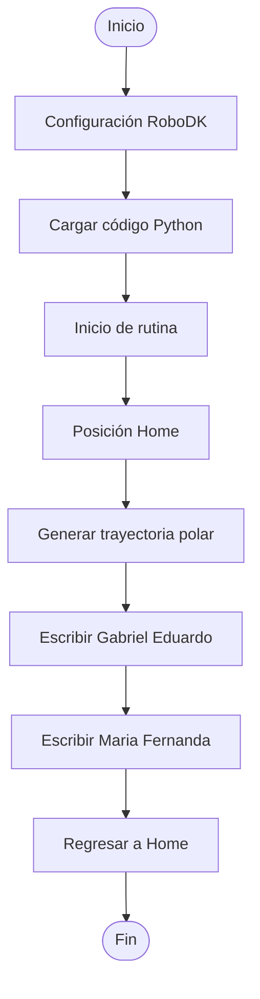

<!-- ===== EQUIPO ===== -->

<!-- ================== INTEGRANTE 1 ================== -->

  

<b>Carrera:</b> Ingeniería Mecatrónica  
<b>Correo:</b> gbojaca@unal.edu.co  
<b>GitHub:</b> <a href="https://github.com/usuariogithub">usuariogithub</a>  
<b>Rol:</b> Simulación y documentación  
<b>Intereses:</b> Robótica móvil, automatización   

Me interesa mucho la simulación y cómo se pueden modelar sistemas mecatrónicos para entender mejor su comportamiento. También me gusta la automatización y la robótica , sobre todo ver cómo funcionan y cómo se pueden mejorar.

  

<!-- ================== INTEGRANTE 2 ================== -->

  

<b>Carrera:</b> Ingeniería Mecatrónica  
<b>Correo:</b> mmorillot@unal.edu.co  
<b>GitHub:</b> <a href="https://github.com/mmorillot">mmorillot</a>  
<b>Rol:</b> Modelado, programación y control  
<b>Intereses:</b> Control de robots, manipulación.  

Actualmente estoy en décimo semestre de Ingeniería. Me interesa el área de control de robots, especialmente entender cómo funcionan y cómo se pueden hacer más precisos. También me llama la atención la parte de manipulación.

---

# 1. Introducción

Los manipuladores industriales son ampliamente utilizados en procesos de automatización debido a su precisión, velocidad y capacidad para ejecutar tareas repetitivas. En este laboratorio se realizó el análisis del manipulador industrial Motoman MH6 y su comparación con el ABB IRB140, identificando sus principales características técnicas, configuraciones iniciales y modos de operación manual.

Además, se trabajó con el software RoboDK para la simulación y ejecución de trayectorias, permitiendo comprender la comunicación entre el software y el manipulador físico. Finalmente, se desarrolló una trayectoria polar ejecutada tanto en simulación como en el robot real.

---

# 2. Cuadro comparativo Motoman MH6 vs ABB IRB140

| Característica | Motoman MH6 | ABB IRB140 |
|---|---|---|
| Fabricante | Yaskawa Motoman | ABB |
| Grados de libertad | 6 | 6 |
| Carga máxima | 6 kg | 6 kg |
| Alcance máximo | 1422 mm | 810 mm |
| Repetibilidad | ±0.08 mm | ±0.03 mm |
| Peso del robot | Aproximadamente 130 kg | Aproximadamente 98 kg |
| Tipo de robot | Manipulador articulado industrial | Manipulador articulado industrial |
| Aplicaciones típicas | Soldadura, manipulación, ensamble, pick and place | Ensamble, laboratorio, pick and place |
| Velocidad | Alta velocidad industrial | Alta precisión |
| Área de trabajo | Mayor alcance operativo | Área de trabajo más compacta |
| Software principal | RoboDK | RobotStudio |

## Análisis comparativo

El Motoman MH6 posee un mayor alcance de trabajo, lo cual lo hace adecuado para aplicaciones industriales de mayor tamaño y manipulación de objetos en áreas amplias. Por otro lado, el ABB IRB140 ofrece una mejor repetibilidad y precisión, siendo útil para tareas que requieren movimientos más exactos.

El Motoman MH6 está más orientado a procesos industriales robustos, mientras que el IRB140 suele emplearse en aplicaciones académicas, laboratorios y líneas compactas de producción.

---

# 3. Configuraciones Home1 y Home2 del Motoman MH6

## Home1

  

| Articulación | Posición aproximada | Descripción |
|---|---|---|
| J1 – Base | 0° | La base está orientada hacia el frente del área de trabajo. |
| J2 – Hombro | -90° aprox. | El brazo principal se encuentra descendido y plegado horizontalmente. |
| J3 – Codo | +90° aprox. | El antebrazo está retraído hacia el cuerpo del robot. |
| J4 – Muñeca Roll | 0° aprox. | La muñeca permanece alineada con el antebrazo. |
| J5 – Muñeca Pitch | -90° aprox. | La herramienta se orienta hacia abajo. |
| J6 – Muñeca Yaw | 0° aprox. | Mantiene la orientación final de la herramienta sin rotación adicional. |

## Home2

  

| Articulación | Posición aproximada | Descripción |
|---|---|---|
| J1 – Base | 0° | La base permanece orientada hacia el frente. |
| J2 – Hombro | +90° aprox. | El brazo principal se encuentra elevado verticalmente. |
| J3 – Codo | 0° aprox. | El antebrazo está extendido hacia adelante. |
| J4 – Muñeca Roll | +90° aprox. | La muñeca rota para mantener la herramienta orientada hacia abajo. |
| J5 – Muñeca Pitch | 0° aprox. | Mantiene estable la inclinación de la herramienta. |
| J6 – Muñeca Yaw | 0° aprox. | Conserva la orientación final del efector. |

## ¿Cuál posición es mejor?

No se trata de determinar cuál posición es mejor, ya que ambas configuraciones cumplen funciones diferentes dentro de la operación del manipulador.  

La posición **Home1** se utiliza principalmente cuando el robot está completamente apagado, siendo adecuada para transporte, almacenamiento o estados seguros del sistema.  

Por otro lado, la posición **Home2** corresponde al estado del robot una vez energizado y con los motores activados. Generalmente, esta es la posición de referencia utilizada durante la programación y ejecución de trayectorias, por lo que es importante tener en cuenta a cuál configuración *Home* se hace referencia dentro del código.

---

# 4. Movimiento manual del manipulador Motoman MH6
# Inicialización del sistema

1. Energizar los tres breakers identificados con el nombre **“MOTOMAN”**.  

  

2. Energizar el totalizador ubicado en el cofre totalizador para suministrar energía al sistema. 

  

3. Girar la perilla ubicada en la puerta del controlador con el fin de energizar la unidad de control **DX100**. 

  

4. Desenrollar cuidadosamente el cable del **Teach Pendant**, evitando pisarlo o generar tensión sobre este. Posteriormente, ubicar el cable detrás del cuello, siguiendo las indicaciones de seguridad dadas durante la práctica.  

5. En el **Teach Pendant**, desactivar la parada de emergencia girando el botón tipo hongo (*Emergency Stop Button*) en sentido horario hasta liberar el sistema.

  

6. Mediante el selector de modo (*Mode Switch*) y la llave de seguridad, configurar el robot en modo **Teach**, permitiendo así la programación y manipulación manual del manipulador.  

  

7. Desde el menú principal del Teach Pendant, seleccionar la opción **Robot** para acceder al control directo del manipulador.  

8. Para habilitar el funcionamiento del robot y permitir la ejecución de movimientos, presionar el botón SERVO ON READY. La activación de los servomotores se confirmará cuando el indicador luminoso permanezca encendido mientras se mantiene presionado el botón de hombre muerto (*Deadman Switch*). 

  

  

## Procedimiento detallado de movimientos manuales (articular ↔ cartesiano;  traslaciones/rotaciones X‑Y‑Z)

1. La selección del sistema de coordenadas y del tipo de movimiento se realiza mediante el botón **COORD**. Dependiendo del modo seleccionado, en la parte superior de la pantalla aparecerá el ícono correspondiente al sistema de movimiento activo.  

  

2. En el modo de movimiento articular (*Joint*), el robot se desplaza manipulando individualmente cada una de sus articulaciones. 

  

3. En el modo de movimiento cartesiano, el desplazamiento del robot se realiza respecto al espacio de trabajo. En este caso, se emplean los botones asociados a los ejes **X, Y** y **Z**, permitiendo movimientos lineales en cada dirección del sistema cartesiano.  

  

- `Cartesian`

### Traslaciones

- X+: movimiento positivo en X
- X-: movimiento negativo en X
- Y+: movimiento positivo en Y
- Y-: movimiento negativo en Y
- Z+: movimiento positivo en Z
- Z-: movimiento negativo en Z

### Rotaciones

- Rx
- Ry
- Rz

Estas rotaciones permiten cambiar la orientación de la herramienta del robot.

---
13. Finalmente, verificar en la parte superior de la pantalla del **Teach Pendant** el ícono correspondiente al modo de movimiento seleccionado antes de ejecutar cualquier desplazamiento del manipulador.

# 5. Niveles de velocidad del Motoman MH6

## Control de velocidad del Motoman MH6

El manipulador Motoman MH6 permite modificar la velocidad de los movimientos manuales desde el *teach pendant*, permitiendo mayor precisión y seguridad durante la operación.

### Niveles de velocidad

- `SLOW` → Movimiento lento y preciso.
- `FAST` → Movimiento rápido.
- `HIGH SPEED` → Movimiento de alta velocidad.

### Cambio de velocidad

1. Identificar en el *teach pendant* los botones de velocidad.

  

2. Seleccionar el modo deseado:
   - `SLOW`
   - `FAST`
   - `HIGH SPEED`
3. El robot ajustará automáticamente la velocidad de movimiento manual.

### Identificación en pantalla
La velocidad seleccionada se visualiza mediante un ícono o indicador en la parte superior de la pantalla del tech.

  
---

# 6. RoboDK

## Aplicaciones principales

RoboDK es un software utilizado para:

- Simulación de robots industriales.
- Programación offline.
- Diseño de trayectorias.
- Validación de movimientos.
- Generación de código para robots reales.

## ¿Cómo mueve el manipulador?

RoboDK calcula las trayectorias y genera instrucciones que son enviadas al controlador del robot para ejecutar los movimientos.

## Comunicación con el manipulador

La comunicación puede realizarse mediante:

- **Remote:**  
  El robot es controlado desde el computador mediante conexión Ethernet, permitiendo ejecutar programas y realizar movimientos directamente desde RoboDK.

- **Play:**  
  El programa es transferido desde el computador al *teach pendant*. Posteriormente, el usuario inicia la ejecución presionando *Play* desde el panel del robot.

- **Teach:**  
  El robot es operado completamente desde el *teach pendant*, permitiendo realizar movimientos manuales, programación y configuración directamente en el controlador.

RoboDK envía comandos al controlador del robot para sincronizar los movimientos físicos con la simulación virtual.

---

# 7. Comparación RoboDK vs RobotStudio

| Característica | RoboDK | RobotStudio |
|---|---|---|
| Compatibilidad | Multimarca | Principalmente ABB |
| Facilidad de uso | Alta | Media |
| Simulación | Sí | Sí |
| Programación offline | Sí | Sí |
| Uso académico | Muy común | Común |
| Interfaz | Intuitiva | Más técnica |
| Aplicaciones | General industrial | Especializado ABB |

## Análisis

RoboDK es una herramienta flexible y compatible con múltiples marcas de robots, facilitando el aprendizaje y la simulación general.

RobotStudio está más enfocado en robots ABB y ofrece herramientas avanzadas específicas para esa plataforma.

## Interpretación personal

RoboDK representa una herramienta práctica para simulación y aprendizaje rápido de robótica industrial. RobotStudio representa una plataforma más especializada para aplicaciones industriales avanzadas con robots ABB.

---

# 8. Trayectoria polar

## Descripción

Se programó una trayectoria polar en RoboDK utilizando movimientos circulares y coordenadas polares.

La trayectoria permitió:

- Simular el movimiento del robot.
- Verificar colisiones.
- Ejecutar el movimiento físicamente.

## Procedimiento general

1. Crear estación de trabajo en RoboDK.
2. Importar robot Motoman MH6.
3. Definir puntos de trayectoria.
4. Programar movimiento circular.
5. Simular la trayectoria.
6. Enviar programa al robot físico.
7. Ejecutar movimiento desde el PC.

---

# 9. Diagrama de flujo

---

# 10. Plano de planta

---

# 11. Conclusiones

- El Motoman MH6 posee mayor alcance y gran capacidad para aplicaciones industriales.
- El ABB IRB140 destaca por su precisión y repetibilidad.
- RoboDK facilita la simulación y programación offline del robot.
- Los movimientos manuales permiten comprender el funcionamiento cinemático del manipulador.
- La trayectoria polar permitió validar la comunicación entre el software y el robot físico.
- La práctica fortaleció los conocimientos relacionados con operación y programación de manipuladores industriales.

---

# 12. Evidencias

## Video

## Archivos anexos

- Código de trayectoria polar.

---

