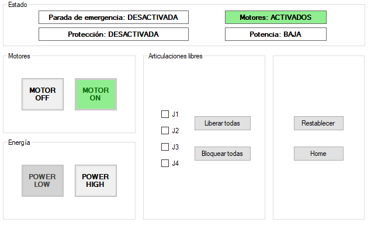
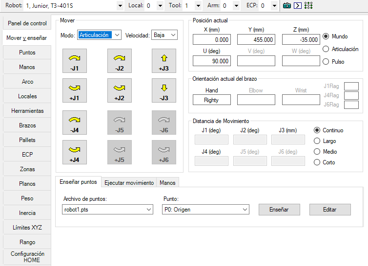
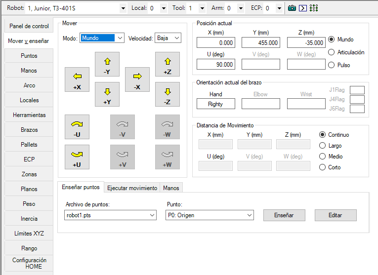
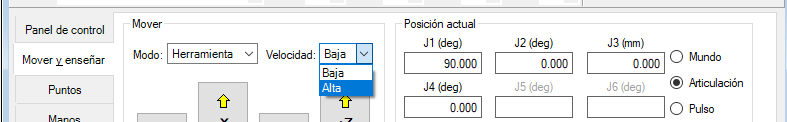
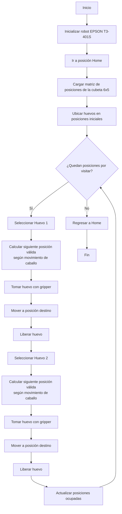
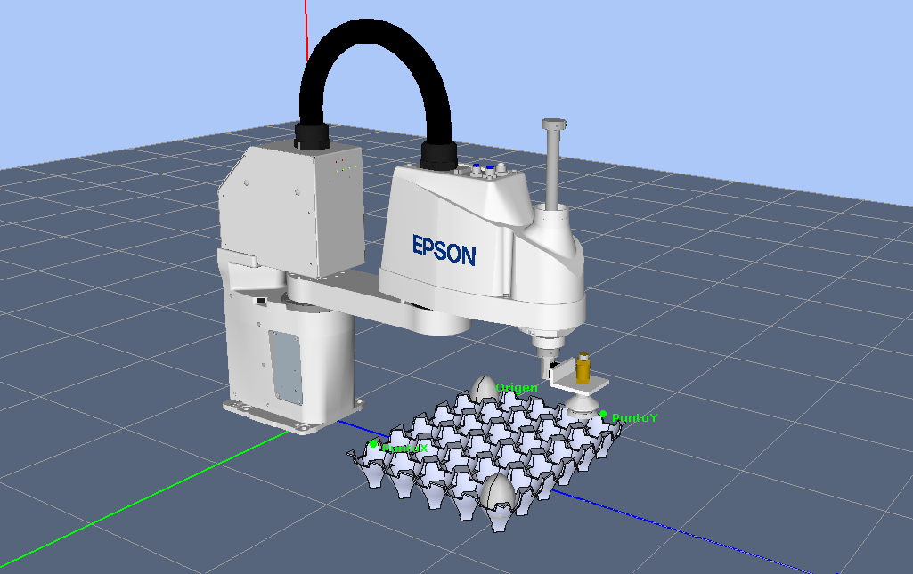
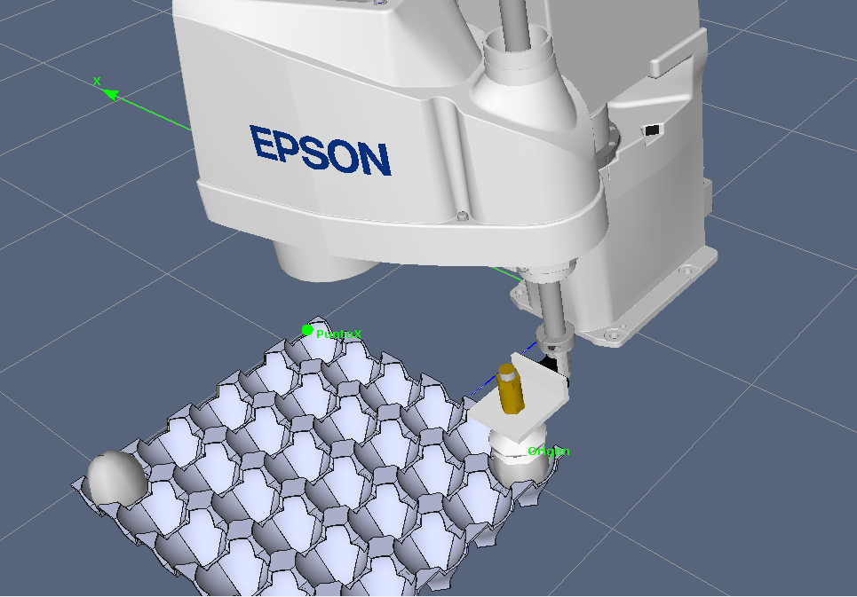

  

  

# Cuadro Comparativo de Robots Industriales

| Característica | Motoman MH6 | ABB IRB 140 | EPSON T3-401S |
|---------------|-------------|-------------|---------------|
| **Tipo de robot** | Articulado | Articulado | SCARA |
| **Grados de libertad (DOF)** | 6 ejes | 6 ejes | 4 ejes |
| **Carga máxima (Payload)** | 6 kg | 6 kg | 3 kg |
| **Alcance máximo** | 1422 mm | 810 mm | 400 mm |
| **Repetibilidad** | ±0.08 mm | ±0.03 mm | ±0.02 mm |
| **Peso del robot** | 130 kg | 98 kg | 16 kg |
| **Montaje** | Piso, pared o invertido | Piso, pared o techo | Mesa o banco de trabajo |
| **Velocidad** | Alta velocidad para manipulación y ensamblaje | Alta aceleración y precisión | Hasta 6000 mm/s en movimiento horizontal |
| **Controlador** | DX100 / FS100 | IRC5 | RC+ |
| **Espacio de trabajo** | Amplio volumen tridimensional | Volumen tridimensional compacto | Área cilíndrica plana de alta velocidad |
| **Precisión** | Alta | Muy alta | Excelente |
| **Aplicaciones típicas** | Manipulación, soldadura, ensamblaje, carga y descarga de máquinas | Ensamblaje, empaque, manipulación, investigación y educación | Pick-and-place, ensamblaje electrónico, clasificación y empaquetado |
| **Ventajas principales** | Gran alcance y flexibilidad | Alta precisión y repetibilidad | Muy rápido, compacto y económico |
| **Limitaciones** | Mayor peso y espacio requerido | Menor alcance que el MH6 | Menos grados de libertad y menor capacidad de carga |

## Análisis Comparativo

- El **Motoman MH6** destaca por su amplio alcance de 1422 mm, lo que lo hace adecuado para tareas de manipulación en áreas de trabajo grandes.
- El **ABB IRB 140** ofrece la mejor combinación de precisión y repetibilidad entre los robots articulados analizados, siendo ideal para aplicaciones que requieren alta exactitud.
- El **EPSON T3-401S** es un robot SCARA optimizado para operaciones de ensamblaje y pick-and-place de alta velocidad, aunque posee menor carga útil y menos grados de libertad.
- Para aplicaciones industriales complejas que requieren orientación completa de herramientas, los robots articulados de 6 ejes (MH6 e IRB 140) son más versátiles.
- Para tareas repetitivas de ensamblaje ligero y manipulación rápida, el EPSON T3-401S presenta una solución más eficiente y económica.
## Configuración Home del EPSON T3-401S

La configuración **Home** del robot EPSON T3-401S corresponde a la posición de referencia utilizada para la inicialización, calibración y enseñanza de trayectorias. En esta posición todas las articulaciones se encuentran en una ubicación conocida, permitiendo establecer correctamente el sistema de coordenadas del robot.

### Posición de las articulaciones en Home

| Articulación | Tipo | Posición Home |
|-------------|------|---------------|
| J1 | Rotacional (Base) | 0° |
| J2 | Rotacional (Brazo) | 0° |
| J3 | Prismática (Eje Z) | Posición superior de referencia (Z = 0 mm) |
| J4 | Rotacional (Herramienta) | 0° |

  

  

### Descripción

- **J1 (Articulación 1):** el primer brazo se orienta hacia la dirección de referencia del robot.
- **J2 (Articulación 2):** el segundo brazo se encuentra alineado con el primero, formando la configuración base del manipulador.
- **J3 (Articulación 3):** el eje vertical se encuentra en su posición superior de referencia.
- **J4 (Articulación 4):** la herramienta o efector final mantiene una orientación neutra sin rotación adicional.

El EPSON T3-401S es un robot tipo SCARA de **4 grados de libertad**, compuesto por dos articulaciones rotacionales para el movimiento en el plano XY, una articulación prismática para el movimiento vertical y una articulación rotacional para orientar el efector final.
## Procedimiento para realizar movimientos manuales en el EPSON T3-401S

Los movimientos manuales del robot EPSON T3-401S se realizan mediante el software EPSON RC+ o utilizando el Teach Pendant (TP). El robot permite operar en diferentes modos de movimiento, principalmente **Joint (Articulaciones)** y **Cartesian (Cartesiano)**.

### 1. Habilitación del robot

1. Encender el robot y el sistema de control.
2. Abrir el software EPSON RC+.
3. Abrir el **"Administrador de Robot (F6)"**.
4. Liberar la parada de emergencia (E-STOP) si está activada con el botón Reestablecer.
5. Encender los motores con el boton **"MOTOR ON"**.
6. Seleccionar la potencia en el apartado **"Energia"**, selecciónando **POWER LOW** O **POWER ON**

  

### 2. Movimiento en modo Joint (Articulaciones)

En este modo cada articulación se mueve de forma independiente.

1. Seleccionar **Jog & Teach**.
2. Elegir el modo **Joint**.
3. Seleccionar la articulación deseada:
   - **J1:** rotación de la base.
   - **J2:** rotación del segundo brazo.
   - **J3:** movimiento vertical (eje Z).
   - **J4:** rotación de la herramienta.
4. Utilizar los botones **+** y **−** para desplazar la articulación seleccionada.
5. Observar el movimiento y detenerlo cuando alcance la posición requerida.

  

### 3. Movimiento en modo Cartesiano

En este modo el robot se mueve respecto al sistema de coordenadas cartesianas.

1. Seleccionar **Jog & Teach**.
2. Cambiar a modo **Cartesian**.
3. Seleccionar el eje que se desea mover:
   - **X:** desplazamiento horizontal.
   - **Y:** desplazamiento horizontal perpendicular al eje X.
   - **Z:** desplazamiento vertical.
4. Utilizar los controles **+** y **−** para mover el robot sobre cada eje.
5. Verificar la posición alcanzada en la ventana de coordenadas.

  

### 4. Traslaciones en los ejes X, Y y Z

#### Movimiento en X
- **X+**: desplaza el efector final hacia adelante.
- **X−**: desplaza el efector final hacia atrás.

#### Movimiento en Y
- **Y+**: desplaza el efector final hacia la izquierda.
- **Y−**: desplaza el efector final hacia la derecha.

#### Movimiento en Z
- **Z+**: eleva el efector final.
- **Z−**: desciende el efector final.

### 5. Rotación de la herramienta

La orientación de la herramienta se controla mediante la articulación J4.

- **R+**: rotación positiva de la herramienta.
- **R−**: rotación negativa de la herramienta.

### 6. Recomendaciones de seguridad

- Verificar que el área de trabajo esté libre de obstáculos.
- Operar inicialmente a baja velocidad.
- Mantener accesible el botón de parada de emergencia.
- No ingresar al espacio de trabajo mientras el robot esté en movimiento.
- Confirmar visualmente cada desplazamiento antes de ejecutar movimientos de mayor amplitud.

### Resumen de modos de operación

| Modo | Descripción |
|--------|------------|
| Joint | Permite mover individualmente cada articulación (J1, J2, J3 y J4). |
| Cartesian | Permite mover el efector final respecto a los ejes X, Y y Z. |
| Tool Rotation | Permite cambiar la orientación del efector final mediante J4. |

## Niveles de velocidad para movimientos manuales

Durante la operación manual del robot EPSON T3-401S, la velocidad de desplazamiento puede ajustarse para facilitar tareas de enseñanza, calibración y posicionamiento seguro. El control de velocidad permite modificar la rapidez con la que se ejecutan los movimientos manuales (Jog).

### Importancia de los niveles de velocidad

Los niveles de velocidad permiten:

- Realizar movimientos precisos durante la enseñanza de puntos.
- Reducir riesgos de colisión durante pruebas y calibración.
- Incrementar la productividad cuando se requieren desplazamientos largos.
- Ajustar la velocidad según la complejidad de la tarea.

### Rangos de velocidad disponibles

En EPSON RC+ la velocidad de movimiento se configura mediante el parámetro **Speed**, cuyo rango puede variar entre:

| Parámetro | Rango |
|------------|--------|
| Speed | 1 % – 100 % |
| Valor predeterminado | 5 % |

A velocidades bajas el robot realiza movimientos lentos y precisos, mientras que a velocidades altas los desplazamientos son más rápidos pero requieren mayor atención del operador.

### Cambio de nivel de velocidad

En la pestaña Mover y enseñar es posible configurar el nivel de velocidad del robot, mientras que en Panel de control se ajusta el nivel de potencia.

**Velocidad: Alta vs. Baja**
- Velocidad baja: el robot se desplaza a menor velocidad debido a una limitación en el parámetro Speed.
- Velocidad alta: permite utilizar valores más elevados del parámetro Speed, lo que incrementa la rapidez de los movimientos.

  

### Identificación del nivel de velocidad actual

La velocidad configurada puede identificarse directamente en la interfaz de EPSON RC+ mediante:

- El indicador **Speed (%)** mostrado en la ventana de Jog.
- La barra deslizante de velocidad.
- El valor numérico asociado al parámetro de velocidad activa.

Ejemplos:

| Valor Speed | Comportamiento |
|------------|---------------|
| 5 % | Movimiento muy lento y seguro para enseñanza |
| 25 % | Movimiento moderado para posicionamiento |
| 50 % | Velocidad media para pruebas |
| 100 % | Velocidad máxima permitida en modo manual |

### Recomendaciones de uso

- Utilizar velocidades entre **5 % y 20 %** durante la enseñanza de trayectorias.
- Verificar que el área de trabajo esté libre de obstáculos antes de aumentar la velocidad.
- Evitar operar a velocidades elevadas cuando se trabaja cerca de los límites del espacio de trabajo.
- Mantener siempre disponible el botón de parada de emergencia durante las operaciones manuales.

### Resumen

El EPSON T3-401S permite ajustar la velocidad de los movimientos manuales mediante el parámetro **Speed**, configurado desde la interfaz de EPSON RC+. El operador puede seleccionar distintos niveles según la tarea a realizar y verificar el valor activo observando el indicador de velocidad mostrado en la ventana de control del robot.
## Análisis comparativo entre EPSON RC+ 7.0, RoboDK y RobotStudio

EPSON RC+ 7.0, RoboDK y RobotStudio son herramientas ampliamente utilizadas en robótica industrial, pero cada una está orientada a necesidades diferentes. Mientras que EPSON RC+ está diseñado específicamente para robots Epson, RoboDK es una plataforma independiente compatible con múltiples fabricantes, y RobotStudio es la solución oficial de ABB para programación y simulación de robots ABB.

### Cuadro comparativo

| Característica | EPSON RC+ 7.0 | RoboDK | RobotStudio |
|---------------|---------------|---------|-------------|
| **Fabricante** | Epson | RoboDK Inc. | ABB |
| **Compatibilidad** | Robots Epson | Más de 1200 robots de más de 80 fabricantes | Robots ABB |
| **Programación offline** | Limitada | Sí | Sí |
| **Simulación 3D** | Básica | Avanzada | Muy avanzada |
| **Gemelo digital (Digital Twin)** | No orientado a ello | Sí | Sí, mediante Virtual Controller |
| **Programación del robot real** | Directa | Generación automática de código para múltiples marcas | Directa para robots ABB |
| **Integración CAD/CAM** | Limitada | Muy amplia | Buena |
| **Visión artificial** | Integrada | Mediante complementos | Mediante herramientas ABB |
| **Facilidad de uso** | Alta | Alta | Media |
| **Aplicación principal** | Operación y programación de robots Epson | Simulación y programación offline multimarca | Simulación y programación avanzada de robots ABB |

---

## Conclusiones

- **EPSON RC+ 7.0** es la mejor opción cuando se trabaja exclusivamente con robots Epson y se requiere una herramienta de programación y operación directa del manipulador.
- **RoboDK** destaca por su compatibilidad multimarca, facilidad de uso e integración con CAD/CAM, siendo especialmente útil en entornos académicos, investigación y programación offline.
- **RobotStudio** ofrece el entorno de simulación más realista para robots ABB gracias a su Virtual Controller, convirtiéndose en la herramienta preferida para aplicaciones industriales avanzadas y desarrollo de gemelos digitales.

En términos generales, para laboratorios universitarios y simulación de múltiples marcas, **RoboDK** suele ser la alternativa más versátil; para aplicaciones reales con robots Epson, **EPSON RC+ 7.0** es la solución más adecuada; y para proyectos industriales basados en ABB, **RobotStudio** proporciona el mayor nivel de precisión y fidelidad.

## Montaje en el simulador

  

  

## Video de simulacion 
https://youtu.be/jgJGLUfFj_I

## Codigo Fuente del programa
[Codigo Fuente](https://github.com/labsir-un/Robotica-2026-I-Equipo-3B-Bojaca-Morillo/blob/396e20bd7b456138cccf55bbc38c0f032f7bec18/Laboratorio%20No.%2003%20-%20Rob%C3%B3tica%20Industrial%20EPSON%20T3%20401S%20y%20EPSON%20RC%2B/Junior_03/Main.prg)
