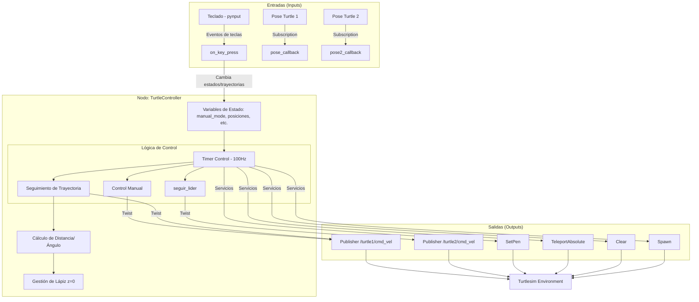
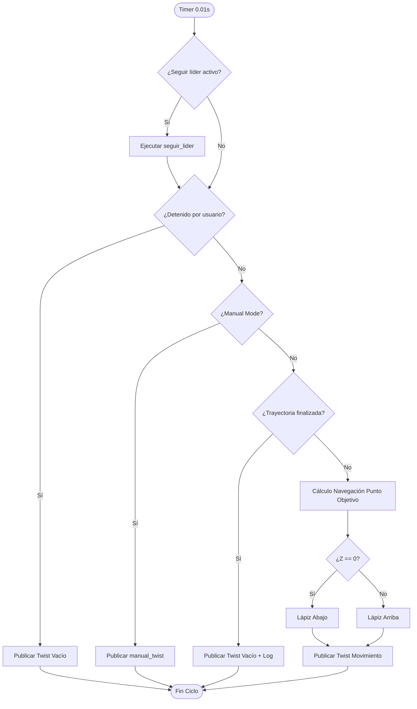
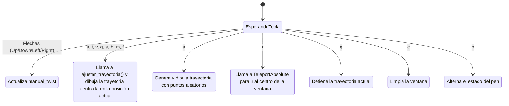

  

  

## Diagrama general

 
 ## Diagrama ciclo principal

## Diagrama interacción con teclas

## Glosario variables de estado:

Estas variables del nodo determinan qué comportamiento debe priorizar el robot en cada ciclo de control (100Hz).

### 1. Control de Navegación y Trayectoria
| Variable | Tipo | Descripción | Función |
| :--- | :--- | :--- | :--- |
| `posiciones` | `list` | Lista de puntos de paso `[x, y, z]` que la tortuga debe visitar. | Define la ruta que la tortuga debe seguir automáticamente. |
| `indice` | `int` | Índice actual de la variable `posiciones`. | Indica en qué punto de la trayectoria se encuentra el robot en este momento. |
| `trayectoria_finalizada`| `bool` | Bandera que indica si el robot ya completó todos los puntos de la lista. | Evita que el robot reinicie la trayectoria o genere logs repetitivos al terminar. |

### 2. Modos de Operación (Prioridades)
| Variable | Tipo | Descripción | Función |
| :--- | :--- | :--- | :--- |
| `manual_mode` | `bool` | Indica si el control está en manos del usuario (teclado). | **Prioridad 1**: Si es `True`, el robot ignora las trayectorias y solo responde a las teclas. |
| `stopped` | `bool` | Bandera de "Pausa" activada por el usuario. | Interrumpe cualquier movimiento. Si es `True`, el robot se detiene inmediatamente. |

### 3. Retroalimentación de Sensores (Feedback)
| Variable | Tipo | Descripción | Función |
| :--- | :--- | :--- | :--- |
| `pose` | `Pose` | Datos de posición (x, y, theta) de la **Tortuga 1**. | Se usa para calcular la distancia y el ángulo hacia el objetivo. |
| `pose2` | `Pose` | Datos de posición (x, y, theta) de la **Tortuga 2**. | Se usa exclusivamente por el comportamiento de seguimiento de líder. |

### 4. Salidas
| Variable | Tipo | Descripción | Función |
| :--- | :--- | :--- | :--- |
| `pen_down` | `bool` | Estado del lápiz de la Tortuga 1 (True = Dibujando, False = Lápiz arriba). | Controla si el robot deja rastro en la pantalla. |
| `manual_twist` | `Twist` | Mensaje de velocidad lineal y angular temporal. | Almacena los movimientos del teclado para ser publicados en el siguiente ciclo. |

### Controles del Robot

| Tecla | Acción en la Simulación |
| :--- | :--- |
| **A** | **Trayectoria Aleatoria:** Genera y ejecuta un camino con 10 puntos al azar en la pantalla. |
| **B** | **Dibujar "B":** Dibuja la letra "B" centrada en la posición actual de la tortuga. |
| **C** | **Limpiar Pantalla:** Borra todos los trazos realizados en el entorno. |
| **E** | **Dibujar "E":** Dibuja la letra "E" centrada en la posición actual de la tortuga. |
| **F** | **Dibujar "F":** Dibuja la letra "F" centrada en la posición actual de la tortuga. |
| **G** | **Dibujar "G":** Dibuja la letra "G" centrada en la posición actual de la tortuga. |
| **M** | **Dibujar "M":** Dibuja la letra "M" centrada en la posición actual de la tortuga. |
| **P** | **Alternar Lápiz:** Activa o desactiva la capacidad de la tortuga para dibujar (deja de dejar rastro o empieza a hacerlo). |
| **Q** | **Parada de Emergencia:** Detiene inmediatamente el movimiento del robot y levanta el lápiz. |
| **R** | **Teletransporte:** Mueve instantáneamente a la tortuga a la posición (5.5, 5.5) con orientación 0. |
| **S** | **Dibujar Cuadrado:** Dibuja una forma de cuadrado centrada en la posición actual. |
| **T** | **Dibujar Triángulo:** Dibuja una forma de triángulo centrada en la posición actual. |
| **V** | **Dibujar "T":** Dibuja la letra "T" centrada en la posición actual de la tortuga. |
| **↑ (Flecha Arriba)** | **Mover Adelante:** Control manual para desplazar la tortuga hacia adelante. |
| **↓ (Flecha Abajo)** | **Mover Atrás:** Control manual para desplazar la tortuga hacia atrás. |
| **← (Flecha Izquierda)** | **Girar Izquierda:** Rotación manual de la tortuga hacia la izquierda. |
| **→ (Flecha Derecha)** | **Girar Derecha:** Rotación manual de la tortuga hacia la derecha. |
### Videos 
https://youtu.be/AThOkcXxe4c
