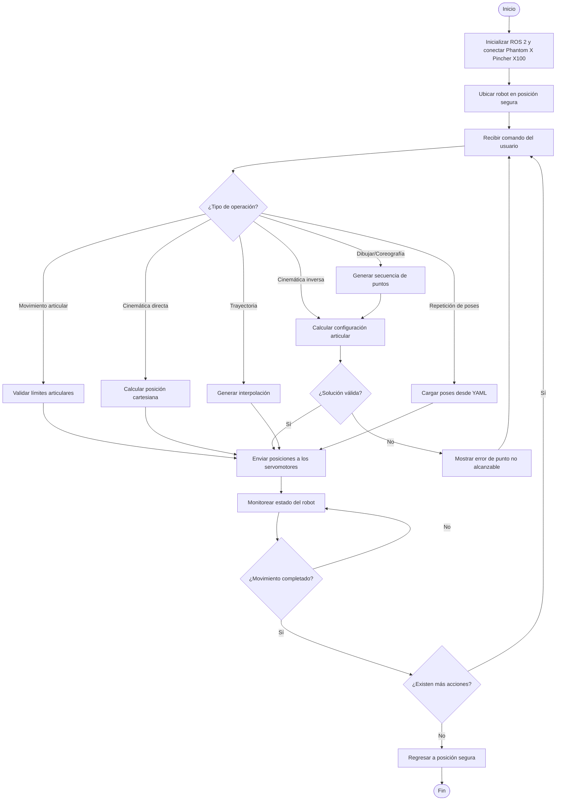

  

  

## Descripcion 
Con base en los requerimientos del laboratorio, la solución debe integrar el control de las articulaciones del Phantom X Pincher X100 mediante ROS 2 Jazzy, implementando las diferentes actividades solicitadas: movimientos individuales, simultáneos y secuenciales, interpolación de trayectorias, cinemática directa e inversa, enseñanza y repetición de poses, trazado de figuras y una coreografía robótica. Todo el sistema debe respetar los límites seguros de cada articulación, validar las posiciones antes de ejecutarlas y permitir la interacción tanto en RViz como con el robot físico. La arquitectura desarrollada recibe comandos del usuario, verifica que las configuraciones sean alcanzables y seguras, calcula la trayectoria o la solución de cinemática correspondiente, ejecuta el movimiento del manipulador y retroalimenta el estado del robot para continuar con la siguiente acción hasta finalizar la tarea.

## Diagrama de flujo 

