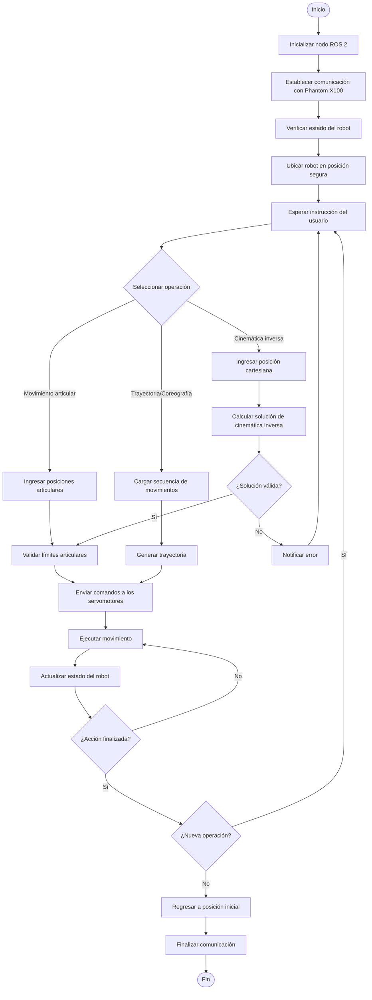

  

  

## Descripcion 
Con base en los requerimientos del laboratorio, la solución debe integrar el control de las articulaciones del Phantom X Pincher X100 mediante ROS 2 Jazzy, implementando las diferentes actividades solicitadas: movimientos individuales, simultáneos y secuenciales, interpolación de trayectorias, cinemática directa e inversa, enseñanza y repetición de poses, trazado de figuras y una coreografía robótica. Todo el sistema debe respetar los límites seguros de cada articulación, validar las posiciones antes de ejecutarlas y permitir la interacción tanto en RViz como con el robot físico. La arquitectura desarrollada recibe comandos del usuario, verifica que las configuraciones sean alcanzables y seguras, calcula la trayectoria o la solución de cinemática correspondiente, ejecuta el movimiento del manipulador y retroalimenta el estado del robot para continuar con la siguiente acción hasta finalizar la tarea.

## Diagrama de flujo 

## Plano de planta 

## Cinematica directa 

## Conclusiones 

Conclusión 1 
La implementación de la cinemática directa e inversa permitió comprender cómo las coordenadas cartesianas y los ángulos articulares se relacionan para controlar el movimiento del robot. Además, el uso de ROS 2 facilitó la ejecución y validación de trayectorias de forma organizada y segura.

Conclusión 2 
El desarrollo de actividades como la interpolación de trayectorias, la enseñanza de poses y el trazado de figuras evidenció la importancia de planificar correctamente los movimientos del manipulador. Esto permitió obtener desplazamientos más suaves y precisos, mejorando el desempeño del robot durante las diferentes tareas.
