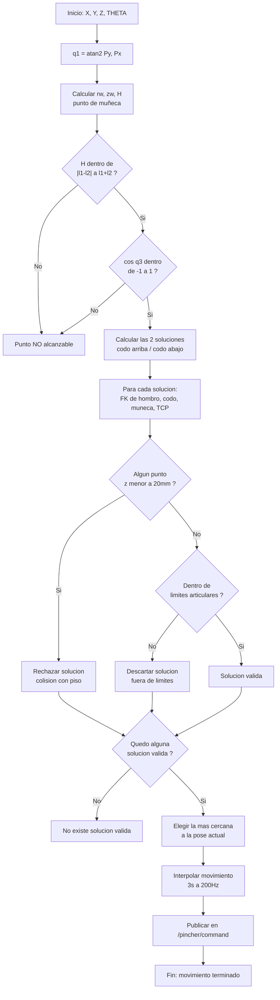

<table>
  <tr>
    <td align="center">
      
    </td>
    <td align="center">
      
    </td>
  </tr>
  <tr>
    <td align="center">
      
    </td>
    <td align="center">
      
    </td>
  </tr>
</table>
# Actividad 12 — Cinemática Inversa PhantomX Pincher (`ik_phantom`)

Esta actividad consiste en programar la cinemática inversa del **PhantomX Pincher X100**: dado un punto en el espacio (X, Y, Z) y un ángulo de muñeca deseado, el robot debe calcular por sí solo qué ángulos necesita cada articulación para llegar ahí, y moverse hasta esa posición sin chocar contra el piso ni salirse de sus límites mecánicos. El script `Actividad_12.py` es justamente eso: recibe el punto objetivo por consola, resuelve la geometría, filtra las soluciones inválidas y ejecuta el movimiento sobre el robot (real o simulado).

## Uso

```bash
python3 Actividad_12.py X Y Z THETA
```

- `X, Y, Z`: posición del TCP en milímetros.
- `THETA`: ángulo de la muñeca respecto a la horizontal, en grados.

**Ejemplo:**
```bash
python3 Actividad_12.py 200 0 150 -45
```

Requiere que el nodo `control_servo` (real o simulado, del paquete `pincher_control` en `phantom_ws`) esté corriendo, ya que este script publica en `/pincher/command` y lee `/joint_states`.

## Parámetros del robot

| Parámetro | Valor | Descripción |
|---|---|---|
| `l1` | 105.6 mm | Hombro → codo |
| `l2` | 105.6 mm | Codo → muñeca |
| `l3` | 92 mm | Muñeca → TCP |
| `base_height` | 127.1 mm | Altura de la base |

## Lógica del algoritmo

1. **`q1`** se obtiene directamente por `atan2(Py, Px)`.
2. Se calcula el punto de muñeca `(rw, zw)` restando la proyección de `l3` en la dirección de `theta`.
3. Se resuelve el triángulo `l1`-`l2` por **ley de cosenos**, generando **dos soluciones** (codo arriba / codo abajo) para `q2` y `q3`; `q4` se deriva para cumplir `theta`.
4. Cada solución se valida contra:
   - **Piso**: ningún punto de la estructura (FK) puede quedar a menos de 20 mm de `z = 0`.
   - **Límites articulares** (con margen de seguridad de 0.10 rad).
5. Entre las soluciones válidas, se ejecuta la más cercana a la configuración articular actual (menor distancia euclídea), con movimiento interpolado (3 s, 200 Hz).

## Diagrama de flujo



## Conclusiones

- El desacople posición-orientación (usar `theta` para ubicar el "punto de muñeca" antes de resolver el triángulo `l1`-`l2`) simplifica bastante el problema y evita tener que resolver las 4 incógnitas al tiempo.
- Tener dos soluciones geométricas (codo arriba/abajo) es útil, pero solo sirve si después se filtran bien contra piso y límites; sin ese filtro el robot podría intentar una configuración físicamente imposible.
- Reutilizar la misma convención DH de `fk_phantom.py` para la verificación anti-colisión fue clave para que el chequeo de piso fuera coherente con el modelo real del robot y no diera falsos positivos/negativos.
- Elegir la solución más cercana a la pose actual (y no simplemente la primera válida) hace que el movimiento sea más suave y predecible en la práctica.

