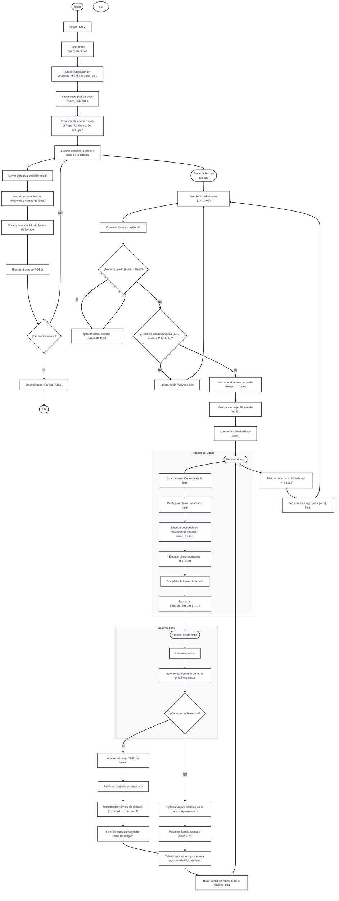

<picture>
    <source srcset="https://imgur.com/5bYAzsb.png" media="(prefers-color-scheme: dark)">
    <source srcset="https://imgur.com/Os03JoE.png" media="(prefers-color-scheme: light)">
    
</picture>

<h3>Curso de Robótica 2026-I</h3>

<h1>Compilado de Informes de Laboratorio de Robótica</h1>

<h2>Profesores:  Pedro Fabián Cárdenas Herrera   Manuel Felipe Carranza Montenegro</h2>

<h4>Nombre Integrante 1 
    Nombre Integrante 2 
    Nombre Integrante 3</h4>

  
  
  
  
  
  
  
  
  
  
  
  
  

---

## Descripción

Este repositorio corresponde al desarrollo de las actividades del curso de **Robótica 2026-I**.  
Aquí se documentan los laboratorios, avances, resultados y la presentación de los integrantes del equipo.

---

## Objetivos del repositorio

- Organizar el desarrollo de los laboratorios del curso.
- Documentar procedimientos, resultados y evidencias.
- Presentar formalmente a los integrantes del equipo.
- Mantener una estructura clara y ordenada para la evaluación.

---

## Integrantes del equipo

### Integrante 1

   

- **Nombre completo:** Nombre Apellido
- **Carrera:** Ingeniería Mecatrónica
- **Correo institucional:** nombre@unal.edu.co
- **Usuario de GitHub:** [usuariogithub](https://github.com/usuariogithub)
- **Rol en el equipo:** Ej. Integración ROS 2, documentación, simulación
- **Intereses:** Robótica móvil, visión artificial, automatización
- **Descripción breve:**  
  Escribe aquí una breve presentación personal y académica del integrante.

---

### Integrante 2

     
 width: 180px;"> 

- **Nombre completo:** Maria Fernanda Morillo Tovar
- **Carrera:** Ingeniería Mecatrónica
- **Correo institucional:** mmorillot@unal.edu.co
- **Usuario de GitHub:** [mmorillot](https://github.com/mmorillot)
- **Rol en el equipo:** Ej. Modelado, programación, control
- **Intereses:** Control de robots, manipulación
- **Descripción breve:**
  Actualmente estoy en décimo semestre de Ingeniería. Me interesa el área de control de robots, especialmente entender cómo funcionan y cómo se pueden hacer más precisos. También me llama la atención la parte de manipulación. Me gusta aprender cosas nuevas y seguir mejorando en temas relacionados con la robótica.

---

     Diagrama de flujo de acciones del robot.

